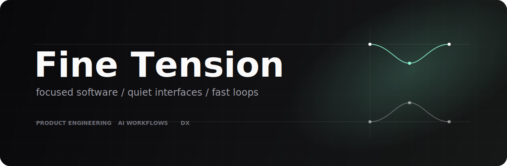

<p align="center">
  
</p>

<p align="center">
  <strong>Focused software. Quiet interfaces. Fast loops.</strong>
</p>

<p align="center">
  Product engineering / AI workflows / Developer tools
</p>

<p align="center">
  
  
  
</p>

---

Fine Tension is a small software lab building useful systems with a clean surface.

We work in public when the work is useful outside the lab: small tools, product prototypes, and AI-native workflows that stay understandable.

```txt
ship small     keep it legible     make it useful
```

#### Projects

Public repositories are being prepared. Expect focused releases around:

- agentic workflows
- developer experience
- product systems
- minimal interfaces

#### Open Source Notes

- Documentation first enough to use the project
- Small APIs over broad frameworks
- Issues for concrete bugs, proposals, and reproducible gaps
- Pull requests welcome once the first public packages land

#### Contact

For now, follow the organization to catch public releases as they ship.
